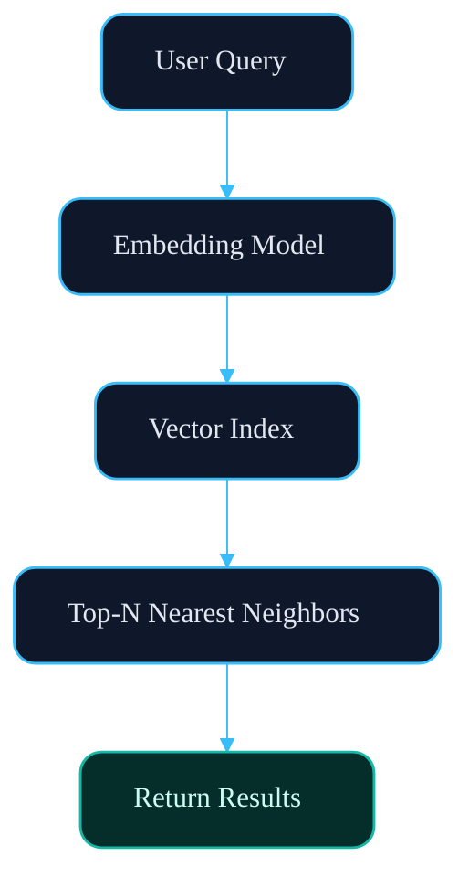
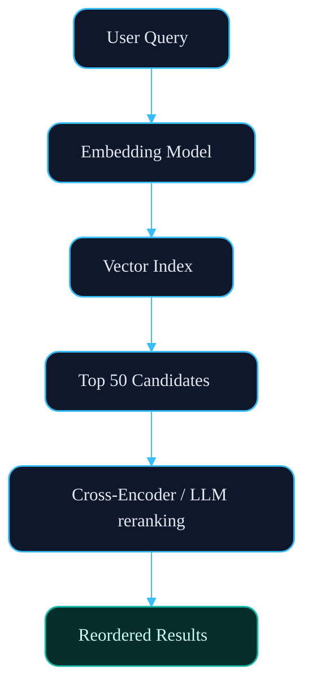
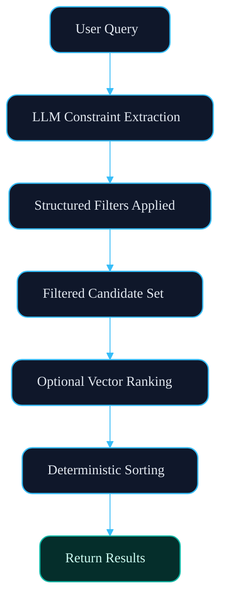
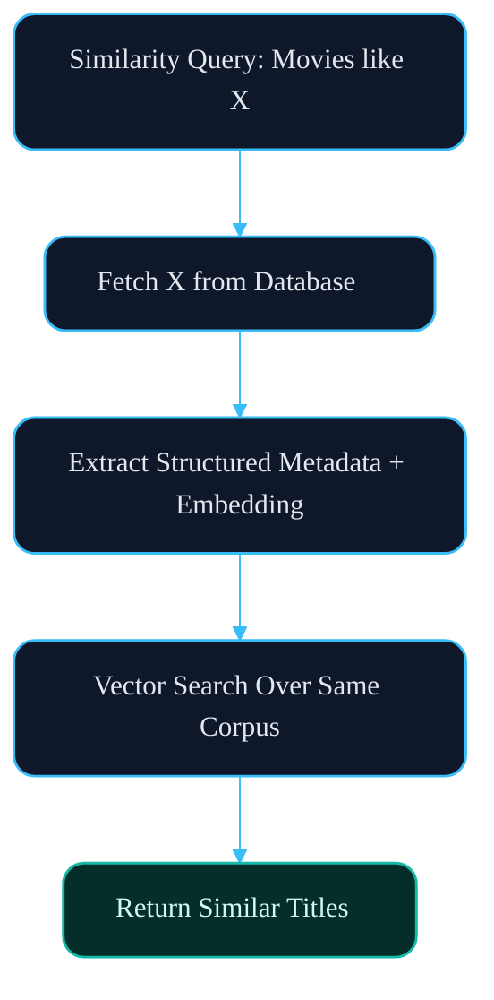

## Part I - Retrieval, Reranking, and the Limits of Vector Search

Most AI products today are thin wrappers around a prompt. They feel intelligent until you require precision. The moment you ask for something exact, they fall apart.

A good public example is the Apple “Zac Wingate” trailer demo. In that scenario, the user asks:

> What’s the name of the guy I had a meeting with a couple of months ago at Cafe Grenel?

That question sounds simple. It isn’t.

To answer it correctly, a system must perform:

- Temporal resolution (“a couple of months ago”)  
- Location filtering (“Cafe Grenel”)  
- Entity extraction (“the guy I had a meeting with”)  
- Disambiguation between multiple meetings  
- Structured recall over personal data  

This is not a generation problem. It is a constraint satisfaction problem over structured data.

The difficulty has nothing to do with prose quality. It has everything to do with correct filtering and ordering across multiple dimensions. That distinction, generation versus constraint satisfaction, is the line between something that sounds intelligent and something that behaves reliably.

There is a difference between generative output and reliable systems. Generative models excel at producing subjective content. A story can be compelling even if it is imperfect. An image can be beautiful even if it is slightly wrong. In these domains, quality is interpretive. Beauty is in the eye of the beholder.

But once a system becomes part of someone’s daily workflow, the tolerance for ambiguity disappears. When a user asks who they met, which movies match certain constraints, or what is available in their region, they are not asking for something aesthetically pleasing. They are asking for something correct.

This shift from generative output to constraint-driven systems changes how the system must be designed.

I have always been fascinated by this kind of problem: the ability to take natural language, vague and expressive, and translate it into something precise and executable. That translation step is where intelligence either emerges or collapses.

This is one of the reasons I started Memovee. A movie recommendation engine looks simple on the surface, but it sits directly at the intersection of:

- Fuzzy taste (“dark psychological thrillers”)  
- Similarity reasoning (“movies like X”)  
- Temporal constraints (“90s action movies”)  
- Numeric ordering (“sorted by highest rating”)  
- Eventually, availability and region constraints  

It forces you to reconcile ambiguity with structure.

And once you try to support all of that inside a single system, you discover something quickly.

Vector search is necessary.  
Vector search is not sufficient.

But neither is simply handing the entire problem to an LLM. Letting the model “figure it out” may work for open-ended generation. It does not reliably enforce constraints, ordering, or correctness over dynamic data.

Embeddings alone are too soft. Pure generation is too unconstrained.

What is required is layering: a system that can

- Extract structure from language  
- Enforce deterministic constraints  
- Apply semantic reasoning where appropriate  
- Orchestrate these components deliberately  

Intelligence in production systems is not a property of the model. It is a property of the architecture that constrains it.

## The Illusion of Pure Vector Search

Vector search is powerful.

Given a natural language query, we can embed it into a dense vector space and retrieve the nearest items from our movie corpus. This works surprisingly well for taste-driven queries.

For example:

> Dark psychological thrillers

Embedding-based retrieval captures tone, theme, and genre similarity. The nearest neighbors tend to cluster around psychologically intense films. For open-ended discovery, this is often good enough.

The typical pipeline looks like this:

Latency is low. Infrastructure is simple. Results feel intelligent.

But this only works when the query is primarily semantic.

---

### Where Vector Search Fails

Now consider a different query:

> 90s action movies sorted by highest rating

This query is no longer purely semantic. It contains:

- A temporal constraint (1990–1999)
- A genre constraint (Action)
- A strict ordering requirement (highest rating first)

If we embed this entire query and run nearest-neighbor search, several problems appear.

First, decade boundaries are not hard constraints in embedding space. A 2001 action film may be semantically closer to “90s action movies” than an actual 1994 film.

Second, “sorted by highest rating” has no clear representation in semantic similarity. Rating is numeric metadata. Embeddings do not inherently encode ordering rules.

Third, cosine similarity optimizes closeness in meaning, not rule satisfaction.

The result is approximate alignment, not deterministic correctness.

You may get:

- Mostly action films
- Some from the 1990s
- Some from adjacent decades
- No guarantee of strict rating order

For casual browsing, this may feel acceptable. For a system intended to be reliable, it is not.

---

### Adding Reranking

A natural improvement is reranking.

Instead of returning the top N vector matches directly, we retrieve a candidate set and pass it to an LLM for evaluation.

The pipeline becomes:

The model examines each candidate relative to the original query and assigns a relevance score.

For semantic refinement, this works well.

Consider:

> Dark psychological thrillers with strong female leads

Vector search may retrieve broadly relevant thrillers. Reranking can downweight films where the female lead is minor or peripheral. It can reason about prominence, tone, and thematic alignment.

Reranking improves precision.

But it still does not enforce constraints.

If the query is:

> 90s action movies sorted by highest rating

An LLM reranker may prefer higher-rated films. It may penalize obvious out-of-decade results. But it cannot guarantee:

- All results fall strictly within 1990–1999
- Results are sorted deterministically by rating
- Numeric constraints are perfectly respected

Why?

Because reranking operates over a probabilistic candidate set. It can adjust ordering, but it cannot retroactively enforce hard filters that were never applied.

If the correct item was not retrieved in the top 50 candidates, reranking cannot invent it.

Reranking improves meaning.
It does not enforce truth.

---

### The Core Limitation

Both pure vector search and vector + reranking share a fundamental limitation:

They treat the query as a single semantic object.

But constrained queries are multi-dimensional. They combine:

- Fuzzy semantics
- Hard numeric filters
- Temporal ranges
- Explicit ordering rules

Embedding space collapses all of these dimensions into a single representation. That collapse works well for similarity, but it is insufficient for precision. At this point, it becomes clear that retrieval is not the system. It is only one layer within it.

## Hybrid Retrieval: Separating Semantics from Constraints

The failure of pure vector search reveals something important:

Constrained queries are not single semantic objects. They are compositions of different problem types.

Consider again:

> 90s action movies sorted by highest rating

This query contains at least three distinct components:

- A semantic component (action)
- A temporal constraint (1990–1999)
- A deterministic ordering rule (rating descending)

Treating all of that as one embedding collapses structure into fuzziness.

Instead, the system must decompose the query.

The first step is not retrieval.  
It is extraction.

The model parses the query and produces structured constraints:

- genre = Action  
- release_year BETWEEN 1990 AND 1999  
- sort_by = rating DESC  

Once those constraints are extracted, they are applied deterministically at the database or search layer.

Only after filtering do we reintroduce semantic ranking, if needed.

The architecture now looks like this:

Notice what changed.

Vector similarity is no longer responsible for enforcing truth.
It operates inside a constrained subset.

This separation of concerns is critical:

- Symbolic filtering enforces correctness.
- Semantic ranking improves relevance within bounds.
- Deterministic sorting guarantees ordering.

Each layer has a clear responsibility. When retrieval and constraint enforcement are separated, the system becomes predictable. Without that separation, correctness is left to probability, and probability is not a substitute for guarantees.

## Similarity Queries and the Illusion of Model Memory

Similarity queries introduce a different kind of failure mode.

Consider:

> Find movies like The Matrix

At first glance, this looks straightforward. An LLM already “knows” The Matrix. It can describe its themes, tone, genre, and stylistic elements. It can generate plausible recommendations directly from its internal knowledge.

For older, culturally dominant films, this often works surprisingly well.

But this approach hides a structural problem.

LLMs are trained on static corpora. Your database is not static.

New movies are released every week. Ratings change. Availability shifts across regions. Metadata evolves. The model’s internal representation does not automatically update with your production data.

If you rely purely on model memory for similarity, you introduce inconsistency:

- Older films perform well.
- Newer films degrade.
- Recently released titles may be mischaracterized or missing entirely.

This is not a quality issue. It is an architectural issue.

The solution is grounding.

Instead of asking the model, “What is The Matrix like?”, we retrieve authoritative seed data from the database:

- Structured metadata
- Keywords
- Genres
- Embeddings generated from the same corpus

The flow becomes:

The model is no longer the source of truth.
It becomes an orchestrator.

By grounding similarity in database-derived embeddings, we ensure:

- Consistency across old and new releases
- Alignment with current catalog state
- Independence from model training cutoffs

This distinction matters. Model memory is probabilistic and static, while database grounding is authoritative and dynamic. In production systems, authority must win.

## Retrieval Is a Layer, Not Intelligence

What began as a simple goal, to recommend good movies, quickly revealed a deeper systems problem.

Vector search captures semantic similarity. Reranking improves nuance. Structured filters enforce constraints. Seed grounding ensures consistency. Each of these components solves a different part of the problem.

But none of them alone constitutes intelligence.

Intelligence in production systems emerges from the way these layers are composed.

When semantic reasoning operates without constraints, you get plausible answers. When constraints are enforced without semantic understanding, you get rigid but uninspiring results. Only when both are orchestrated deliberately does the system become reliable.

Retrieval is necessary. Reranking is helpful. Grounding is essential.

But none of them are the system.

They are layers.

Once you begin thinking in layers instead of prompts, the design problem changes entirely.

In the next part, we will move beyond retrieval and explore what happens when the system must decide how to think, how to decompose problems, verify tool use, and construct context dynamically at runtime.

Because retrieval is only the beginning.

---

## A Note on Practice

Everything described in this post comes from solving real production challenges at Upmaru.

These were not theoretical exercises. They emerged from building systems that needed to behave reliably under real user queries.

The [Kritama](https://kritama.com) engine applies these architectural principles directly. It provides the orchestration layer that decomposes queries, extracts structure, enforces constraints, and composes semantic reasoning deliberately. [Memovee](https://memovee.com) is one of the systems powered by Kritama.

If you are curious how this feels in practice, you can try Memovee directly as a chat-based movie discovery system:

👉 [Try Memovee](https://memovee.com)

For a more focused look at the search layer described in this post, you can explore the demo here:

👉 [Memovee Search Demo](https://memovee.com/platform/demo?guest_account_id=019c6664-24ea-71a5-ba4c-b496a19be778)

The goal is not to demonstrate prompt cleverness. It is to demonstrate layered intelligence under constraint.

Part II will explore how orchestration and runtime decision-making build on top of this retrieval foundation.
