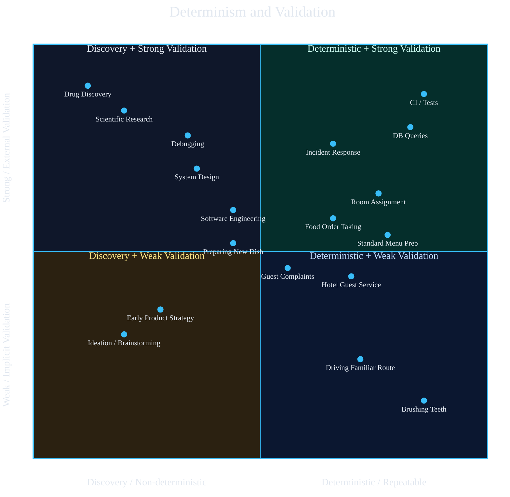
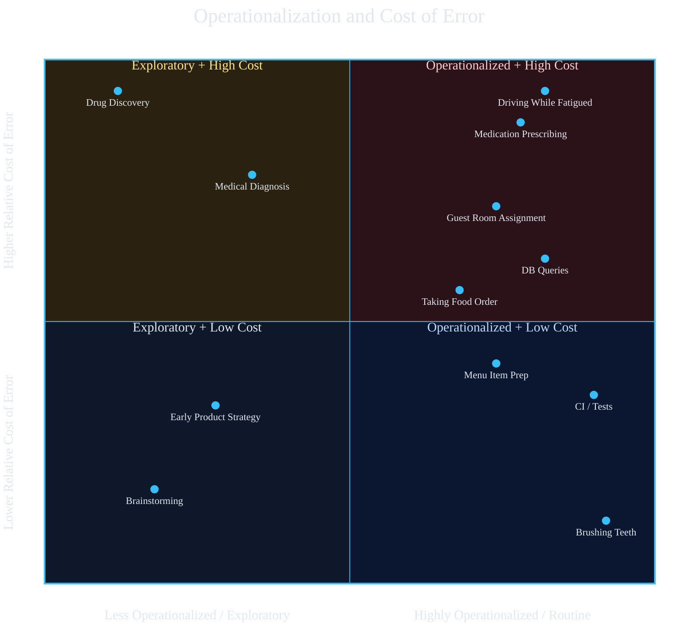
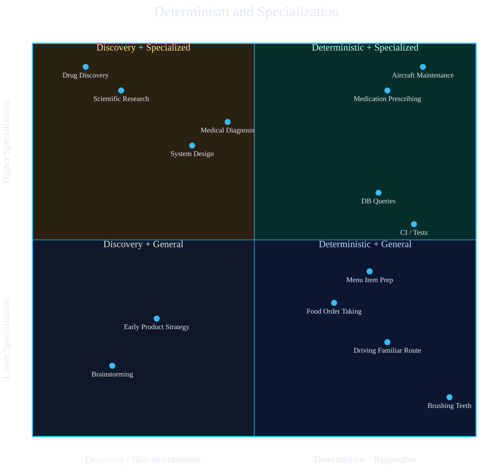
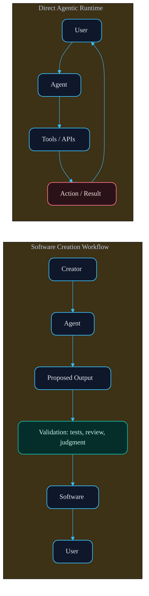

## Part II - Intelligence Is Multi-Dimensional

As humans, we operate across a broad spectrum of tasks, ranging from open-ended discovery to precise, repeatable execution.

In [Part I: Intelligence Is an Architecture Problem](/blog/intelligence-is-an-architecture-problem), I argued that intelligence in production systems comes from architecture rather than prompts. This post builds on that idea by making the task landscape more explicit: what kinds of work systems actually need to perform, and which dimensions matter when designing them.

The main point of this post is simple: intelligence is not a single property. Different tasks vary along multiple dimensions, and the systems that perform them well need different architectures, feedback loops, and safeguards.

The three core dimensions we will focus on are:

- Determinism
- Validation
- Specialization

Cost of error acts as a fourth force that shapes how much constraint layering a workflow needs once it becomes operationalized.

On one end of the spectrum are **discovery tasks**. These are inherently non-deterministic. The goal may be clear, but the path to get there is not. Progress requires experimentation, iteration, and continuous validation. You try something, observe the outcome, adjust, and try again.

Scientific research is a canonical example. A researcher may aim to understand a phenomenon or validate a hypothesis, but the process involves designing experiments, interpreting ambiguous results, and refining approaches over time. Similarly, software engineering, especially when building something novel, follows this pattern. You write code, run it through compilers, linters, and tests, and use those feedback systems to guide you toward a working solution. The intelligence here lies not just in producing outputs, but in navigating uncertainty.

Other examples of discovery tasks:

- Designing a new product or startup
- Debugging a complex distributed system
- Developing a new drug or treatment
- Crafting a novel algorithm or architecture

These tasks rely heavily on **external validation loops**, such as experiments, tests, simulations, and peer review, which help determine whether you are moving in the right direction.

---

On the opposite end are **deterministic execution tasks**. These are tasks where both the goal and the method are well understood. Execution is expected to be reliable, consistent, and often requires little conscious deliberation.

For example, when a doctor prescribes a standard treatment for a well-understood condition, they are applying established knowledge. When you query a database with known criteria, you expect a precise result. When you drive a familiar route, most decisions are automatic, guided by learned patterns rather than active reasoning.

Other examples of deterministic execution tasks:

- Executing a known API call or database query
- Executing a safety checklist or standard workflow
- Performing routine medical procedures
- Assembling a product on a production line
- Taking and processing restaurant orders
- Servicing hotel guests within a standard workflow
- Navigating a daily commute

In these cases, validation is often immediate or implicit. You know the task is complete because it matches your intent or expected outcome. There is little ambiguity and minimal need for iterative exploration.

---

Between these two extremes lies a continuum. Most real-world work is not purely discovery or purely deterministic execution, but a blend of both. Even routine tasks can encounter edge cases that require exploration, and discovery tasks often decompose into smaller deterministic steps.

Understanding this spectrum is critical. It shapes how we design systems, tools, and workflows, especially when building intelligent systems. Some problems demand flexibility, iteration, and feedback loops. Others demand reliability, precision, and repeatability.

---

## 1. Determinism and Validation

Now that we have a clearer view of the spectrum, we can start breaking it into concrete dimensions. The first and most important is the relationship between determinism and validation.

The chart below is meant to be read simply: the further left a task sits, the more exploratory it is; the further right it sits, the more repeatable it is. The higher it sits, the more it depends on strong external validation loops.

**Axes**

- X-axis: Discovery -> Deterministic execution
- Y-axis: Weak validation -> Strong external validation

**Additional dimensions**

- Cost of error: Ranges from low (brushing teeth) to very high (drug discovery)
- Time horizon: Ranges from immediate (driving) to long-term (scientific research)
- Output evaluation: Often ranges from more subjective under weak validation to more objective under strong external validation

Subjectivity of output often correlates with weaker validation, but it is not the same dimension. Objective tasks usually allow stronger validation loops, but not always immediately.

The main takeaway is that tasks toward the upper-left require more exploration and stronger feedback loops, while tasks toward the right demand greater reliability, precision, and constraint enforcement.

## 2. Operationalization and Relative Cost of Error

There is another important pattern here. Once a task becomes highly operationalized, the cost of error often increases rather than decreases. That is precisely why these tasks get operationalized in the first place: the system needs to be reliable because mistakes are expensive.

**Axes**

- X-axis: Less operationalized -> Highly operationalized
- Y-axis: Lower relative cost of error -> Higher relative cost of error

#### Relative Cost

> Cost of error here is relative to the workflow itself, not absolute societal harm. A wrong food order is not in the same severity class as prescribing the wrong medication, but within the restaurant workflow it is still a meaningful failure because the customer rejects the dish, service must be redone, and the process fails immediately. The same logic applies to database queries and CI tests: if they return the wrong result, they become useless right away inside that workflow.

The point of this chart is not that operationalized tasks are always low-risk. Often the opposite is true. The most operationalized tasks are the ones where the organization cannot afford frequent mistakes.

This is also why operational high-cost tasks tend to accumulate **constraints**. The system around the task is designed to make the work repeatable and correct, not merely efficient.

Cars are a good example. Driving is highly operationalized, but the cost of error can be catastrophic, so the system includes seat belts, lane assistance, collision warnings, and increasingly even alcohol-detection checks. Medication prescribing works the same way. It is not just a person making an unconstrained judgment. It is usually a certified doctor operating inside protocols, dosage rules, pharmacy checks, and nurse oversight. Guest room assignment in hotels is similar. The front desk does not simply rely on memory; the property management system exists precisely to prevent assigning the same room to multiple guests or violating reservation constraints.

In other words, **operationalization at high cost usually implies constraint layering**. The more expensive the error, the more the system needs safeguards, validation, and structured decision boundaries to keep the task reliable.

## 3. Determinism and Specialization

Specialization is another important dimension of intelligence. Some tasks can be performed by almost anyone with minimal instruction, while others require years of training, domain knowledge, and judgment.

There is often a correlation between determinism and specialization. The more deterministic a task is, the easier it is to standardize, teach, and operationalize at scale. The more exploratory a task is, the more it tends to depend on specialized expertise.

But this relationship is not absolute. Some tasks are highly deterministic and still require deep specialization because the margin for error is extremely small. Medication prescribing is a good example. The workflow may be structured, but the expertise required is still high.

**Axes**

- X-axis: Discovery / non-deterministic -> Deterministic / repeatable
- Y-axis: Lower specialization -> Higher specialization

#### Specialization

> Specialization here refers to the amount of training, domain knowledge, and practiced judgment a task requires to perform well. A task can be highly deterministic and still sit high on specialization if the allowed margin for error is extremely small.

The main takeaway is that deterministic does not mean easy, and exploratory does not automatically mean expert-only. What matters is how much training, judgment, and domain knowledge the task actually demands.

## Software Development vs Direct Agentic Runtime

Taken together, these dimensions form a more useful framework for thinking about intelligence in real systems.

One useful way to see this is to compare pure LLM-driven workflows with agentic systems.

LLMs with a bit of harness tend to perform best on discovery-oriented tasks, especially when the environment already contains strong external validators. Software engineering is a good example. A model can propose code, run tests, hit compiler errors, read linter output, and iterate. Mistakes are acceptable because the surrounding system exposes them early, and the human operator can validate before anything reaches production.

Agentic systems are usually solving a different class of problem. They sit much closer to operationalized tasks where the cost of error is higher and the expectation is not "produce something plausible," but "do the correct thing under real constraints." If an agent looks up information, books a hotel, changes a reservation, or executes a workflow step, the result must be correct. A natural-language answer that sounds right is not enough. The agent has to satisfy the constraints of the world it is acting in.

That is why the core challenge in agentic systems is often not specialization in the human sense. The agent does not always need years of domain expertise. What it does need is the ability to get the constraints right: valid state transitions, correct filters, correct tool usage, correct identifiers, correct sequencing, and correct handling of failure cases.

In other words, discovery systems are often judged by whether they can iterate toward a solution. Agentic systems are judged by whether they can execute correctly within bounded rules. The first benefits enormously from models plus feedback loops. The second depends much more heavily on architecture, constraint enforcement, and system design.

Another useful way to frame this is in terms of who is present when the system creates value.

In software development in the agentic era, there are effectively three parties:

- The creator of the software
- The agent
- The user

During software creation, the first two work together. The agent proposes code, transformations, refactors, and test fixes. The creator reviews the output, runs tooling, applies judgment, and decides what reaches production. The act of consumption happens later, when the user interacts with the finished software rather than with the raw intermediate outputs of the agent.

That separation matters. The creator acts as a validator between generation and real-world consequences.

At scale, many agentic systems do not have that buffer. When a user interacts with an agent directly, there is no creator in the loop to clean up mistakes before the result reaches reality. If the agent returns the wrong information, books the wrong hotel, selects the wrong flight, or executes the wrong workflow step, the user absorbs the consequence immediately.

This is why agentic systems cannot be evaluated the same way as software-generation workflows. In one case, the agent is part of a creation loop with validators, tooling, and human oversight. In the other, the agent is part of the runtime product itself. Once the agent becomes the thing the user is directly consuming, correctness stops being a nice-to-have and becomes the product.

## What This Means for Intelligent Systems

- Discovery-heavy tasks need experimentation, iteration, and strong feedback loops.
- Deterministic tasks need reliability, consistency, and constraint enforcement.
- High-cost operational tasks tend to accumulate safeguards because mistakes are expensive.
- Highly specialized tasks need trained judgment even when the workflow itself is structured.

This is why building intelligent systems is not just a matter of choosing a stronger model. The right architecture depends on the shape of the task. Some workflows need broad reasoning and exploration. Others need narrow correctness under tight constraints. Many need both, but at different stages of the workflow.

It is also not just a matter of scaling to bigger models. Larger models may be extremely strong at exploratory work, open-ended reasoning, and generation-heavy tasks. But on agentic workflows and constraint-satisfaction problems, smaller models can outperform larger ones if the system around them is designed correctly and the task is structured well.

That is one of the reasons we run benchmarks like [Simple Tama Agentic Workflow - Q1 2026](/llm-tests/simple-tama-agentic-workflow-q1-2026). Readers will find that smaller models outperform larger ones on several tests. The goal is not to reward the model that sounds the smartest in isolation. The goal is to see which systems actually behave correctly inside an operational workflow.

If you ignore these distinctions, the system will feel intelligent in demos and fail in production. If you design for them explicitly, you can build systems that are not only capable, but reliable.
